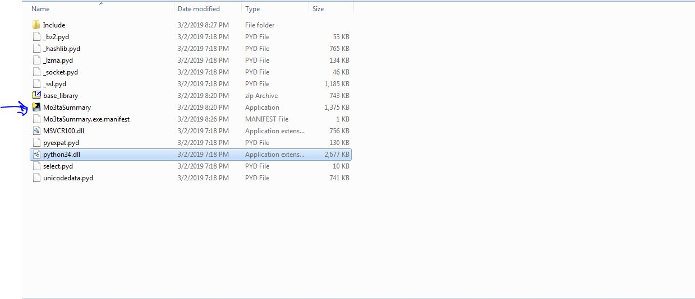
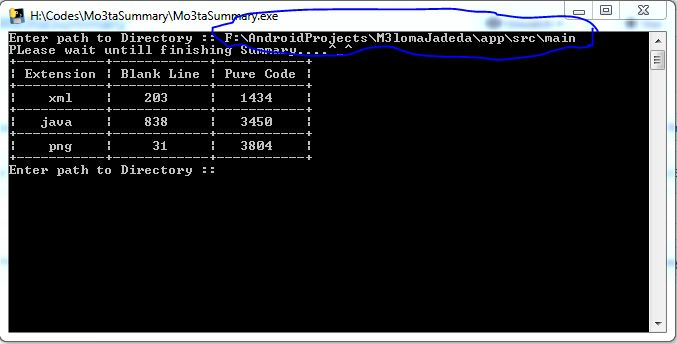

# Mo3taSummary
simple app to summary your project code

# How to use (Windows machines): 
 - extract Mo3taSummary.zip 
    - 
 - run Mo3taSummary.exe 
 - Enter path to your project
  - 
 - enjoy with your Summary.

# How to use All machines:
 - install dependencies by ``` pip install requirements.txt  ``` 
 - then ``` py Mo3taSummary.py  ```
 - let`s have fun
